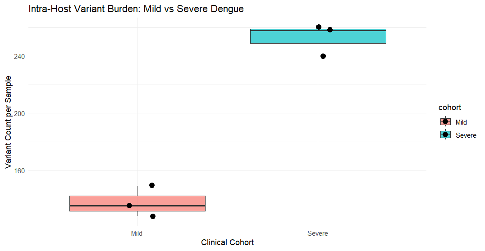
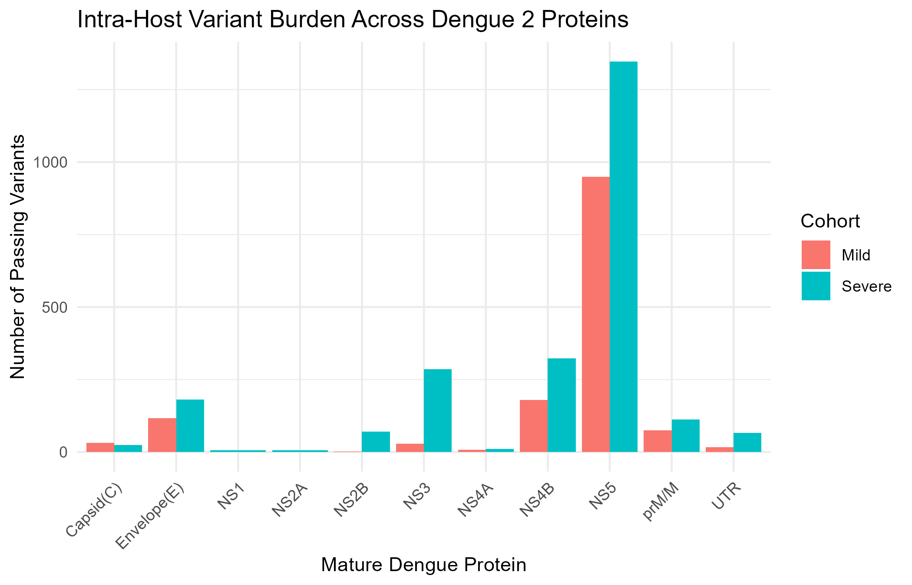
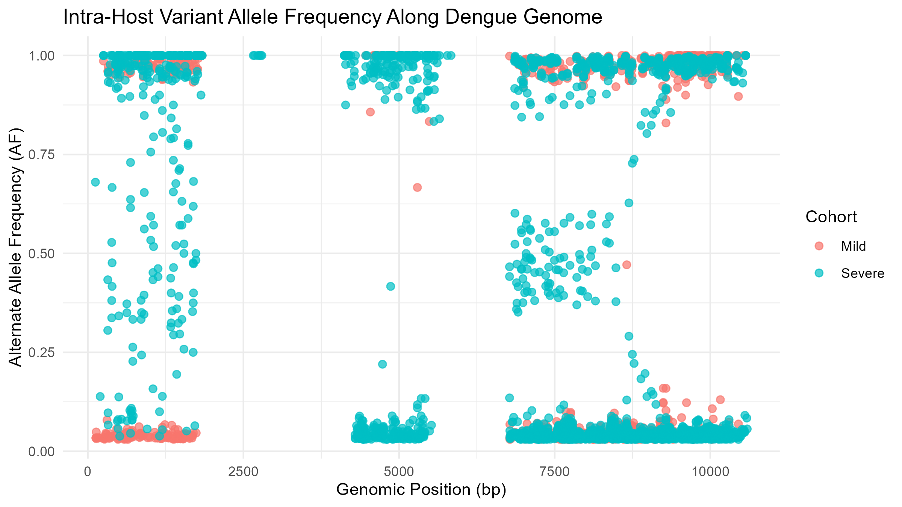

# LLRI Bioinformatics Project
# Intra-Host Genomic Variation Analysis of Dengue Virus Serotype 2: Mild vs. Severe Infection

## Objective
This project investigates intra-host genomic diversity and mutation burden in *Dengue virus serotype 2* (DENV-2) infections through the comprehensive analysis of high-throughput sequencing data. The analytical workflow compares viral variant counts, Transition/Transversion (Ti/Tv) ratios, and allele frequency (AF) spectrum distributions between mild (primary) and severe (secondary) Dengue infection cohorts.

---

## Datasets
The analysis comprises two distinct clinical cohorts of DENV-2-infected patients (n = 6 total samples) with sequencing data retrieved from the NCBI Sequence Read Archive (SRA):

### Patient Cohorts
* **Group A: Mild Dengue Fever (DF) — Primary Infection**
  * [DRR067444](https://www.ncbi.nlm.nih.gov/sra/DRR067444) (D2-2A-Hue-534-4MV)
  * [DRR067448](https://www.ncbi.nlm.nih.gov/sra/DRR067448) (D2-1A-Hue-519-3U)
  * [DRR067449](https://www.ncbi.nlm.nih.gov/sra/DRR067449) (D2-2A-Hue-534-4U)
  
* **Group B: Severe Dengue (Dengue Hemorrhagic Fever [DHF]) — Secondary Infection**
  * [DRR067462](https://www.ncbi.nlm.nih.gov/sra/DRR067462) (D2-2B-Hue-534-4U)
  * [DRR067463](https://www.ncbi.nlm.nih.gov/sra/DRR067463) (D2-3B-Hue-101-7U)
  * [DRR067465](https://www.ncbi.nlm.nih.gov/sra/DRR067465) (D2-5B-Hue-106-9U)
  
### Reference Sequence
* **Reference Genome:** *Dengue virus serotype 2* complete genome (GenBank accession: [NC_001474.2](https://www.ncbi.nlm.nih.gov/nuccore/NC_001474.2); 10,723 bp)

---

## Workflow Architecture

### 1. Preprocessing & Alignment (Linux / Terminal)
1. **Quality Control:** Run initial read inspection via `fastqc`.
2. **Trimming:** Filter low-quality bases (`-q 20`) and short reads (`--length_required 50`) using `fastp`.
3. **Alignment:** Index reference genome (`NC_001474.2`) and align trimmed FASTQ reads using `bwa mem`.
4. **BAM Processing:** Convert SAM to BAM, sort, and index via `samtools`.
5. **Variant Calling:** Call intra-host single nucleotide variants and indels using `freebayes` (`--min-alternate-fraction 0.05 --min-coverage 10 -p 1`) and an alternative tool `ivar` which converts the sorted bam files to tsv files containing annotated gene information.

```bash
# Quality trimming loop
for sample in DRR067444 DRR067448 DRR067449 DRR067462 DRR067463 DRR067465; do
  fastp -i rawfastq/${sample}.fastq.gz \
        -o trimmed_result/${sample}.trimmed.fastq.gz \
        -h qc/${sample}_fastp.html \
        -j qc/${sample}_fastp.json \
        -q 20 --length_required 50
done

# BWA Alignment, Indexing and sorting 
bwa index reference/dengue_ref.fasta
samtools faidx reference/dengue_ref.fasta

for sample in DRR067444 DRR067448 DRR067449 DRR067462 DRR067463 DRR067465; do
  bwa mem reference/dengue_ref.fasta trimmed_result/${sample}.trimmed.fastq.gz > aligned/${sample}.sam
  samtools view -bS aligned/${sample}.sam \vert{} samtools sort -o aligned/${sample}.sorted.bam
  samtools index aligned/${sample}.sorted.bam
  rm aligned/${sample}.sam
done

# Variant calling with Freebayes
for sample in DRR067444 DRR067448 DRR067449 DRR067462 DRR067463 DRR067465; do
  freebayes -f reference/dengue_ref.fasta \
            -p 1 \
            --min-alternate-fraction 0.05 \
            --min-coverage 10 \
            aligned/${sample}.sorted.bam > variants/${sample}.vcf
done
```

### 2. Variant Calling & Annotation using iVar (Linux / Terminal)

An alternative approach to variant calling is to use the **iVar** tool, which is specifically designed for viral samples and provides enhanced detection of intra-host variants. iVar converts sorted BAM files directly into annotated TSV files with variant counts, allele frequencies, and gene feature information.

#### Installation
```bash
conda install -c bioconda samtools ivar
```

#### Workflow: Sorted BAM → iVar TSV → Annotated TSV

**Step 1: Create output directories**
```bash
mkdir -p ivar_results
mkdir -p ivar_results/annotated
```

**Step 2: Run iVar variant calling for all samples**

iVar uses `samtools mpileup` to generate pileup format, which is then processed to call variants. The process generates a TSV file with variant position, depth, allele frequency, and p-value information.

```bash
for sample in DRR067444 DRR067448 DRR067449 DRR067462 DRR067463 DRR067465; do
  echo "Processing ${sample}..."
  samtools mpileup -A -d 0 --reference ./data/dengue2/sequences.fa -B -Q 0 \
    "./aligned/${sample}.sorted.bam" | \
  ivar variants \
    -p "./ivar_results/${sample}_ivar" \
    -q 20 \
    -t 0.03
done
```

**Parameters:**
- `-A`: Count orphaned reads
- `-d 0`: Ignore read depth cap
- `--reference`: Reference sequence file
- `-B`: Disable BAQ calculation
- `-Q 0`: Minimum base quality
- `-p`: Output prefix for iVar results
- `-q`: PHRED quality threshold (20)
- `-t`: Minimum alternate allele frequency threshold (3%)

**Output:** TSV files with columns: REGION, POS, REF, ALT, REF_DP, REF_RV, REF_QUAL, ALT_DP, ALT_RV, ALT_QUAL, ALT_FREQ, TOTAL_DP, PVAL, PASS

**Step 3: Annotate iVar TSV files with gene features**

Add gene/protein feature annotation to variants based on genomic position using Dengue 2 reference coordinates:

```bash
for sample in DRR067444 DRR067448 DRR067449 DRR067462 DRR067463 DRR067465; do
  echo "Annotating ${sample}..."
  awk -F '\t' 'BEGIN {OFS="\t"} 
    NR==1 {print $0, "FEATURE"} 
    NR>1 {
      pos=$2;
      if (pos >= 97 && pos <= 438) gene="Capsid(C)";
      else if (pos >= 439 && pos <= 936) gene="prM/M";
      else if (pos >= 937 && pos <= 2421) gene="Envelope(E)";
      else if (pos >= 2422 && pos <= 3477) gene="NS1";
      else if (pos >= 3478 && pos <= 4131) gene="NS2A";
      else if (pos >= 4132 && pos <= 4521) gene="NS2B";
      else if (pos >= 4522 && pos <= 6375) gene="NS3";
      else if (pos >= 6376 && pos <= 6825) gene="NS4A";
      else if (pos >= 6826 && pos <= 7560) gene="NS4B";
      else if (pos >= 7561 && pos <= 10269) gene="NS5";
      else gene="UTR";
      print $0, gene 
    }' "./ivar_results/${sample}_ivar.tsv" > "./ivar_results/annotated/${sample}_annotated.tsv"
done
```

**Output:** Annotated TSV with additional FEATURE column containing gene names (Capsid, prM, Envelope, NS1-NS5, or UTR).

**Step 4: Consolidate into master variant file**

Combine all annotated variants (PASS variants only) into a single master file for comparative analysis:

```bash
# Create header
echo -e "Sample\tRegion\tPos\tRef\tAlt\tRef_DP\tAlt_DP\tAlt_Freq\tTotal_DP\tPVal\tPass\tGene_Feature" \
  > ivar_results/master_annotated_variants.tsv

# Append PASS variants from all samples
for f in ivar_results/annotated/*_annotated.tsv; do
  sample=$(basename "$f" _annotated.tsv)
  awk -v s="$sample" -F '\t' 'BEGIN {OFS="\t"} $14 == "TRUE" {print s, $1, $2, $3, $4, $5, $8, $11, $12, $13, $14, $15}' "$f" \
    >> ivar_results/master_annotated_variants.tsv
done

# View results
head -n 5 ivar_results/master_annotated_variants.tsv
wc -l ivar_results/master_annotated_variants.tsv
```

**Dengue 2 Gene Coordinates Reference (NC_001474.2):**
*Source: RefSeq Dengue virus 2, complete genome (NC_001474.2) - GenBank record and associated GFF3 annotations*

| Gene | Region | Position Range |
|------|--------|----------------|
| 5' UTR | Untranslated | 1-96 |
| Capsid (C) | Structural | 97-438 |
| Precursor Membrane (prM/M) | Structural | 439-936 |
| Envelope (E) | Structural | 937-2421 |
| NS1 | Non-structural | 2422-3477 |
| NS2A | Non-structural | 3478-4131 |
| NS2B | Non-structural | 4132-4521 |
| NS3 | Non-structural (Protease/Helicase) | 4522-6375 |
| NS4A | Non-structural | 6376-6825 |
| NS4B | Non-structural | 6826-7560 |
| NS5 | Non-structural (RNA-dependent RNA polymerase) | 7561-10269 |
| 3' UTR | Untranslated | 10270+ |

---

## 2. Downstream Analysis & Visualization (R / RStudio)
Variant call format (VCF) and iVar TSV files are analyzed using R (v. ≥4.0) with the following packages: `vcfR` (v. ≥1.12), `tidyverse` (v. ≥1.3), and `ggplot2` (v. ≥3.3).

### Analysis Parameters
- **Quality Filtering:** Variants retained with QUAL ≥ 20
- **Allele Frequency Thresholds:** Major variants (AF ≥ 0.50); Minor variants (AF < 0.50)
- **Transition/Transversion Analysis:** Substitution bias evaluation across cohorts
- **Statistical Test:** Welch's two-sample *t*-test (α = 0.05) for variant count comparisons between cohorts

Complete R scripts for variant analysis and visualization are provided in this repository.

```r
# Execute the R script file provided.
source("variants_analysis.R")

# For analysis of ivar results (TSV files), execute the R script file below.
source("ivar_result_analysis.R")
```

## 3. Results and Data summaries

1. Total Raw variant counts per sample vs quality filtered variant counts.

| Sample ID | Cohort | Total Variant count | Quality filtered variant count |
| --- | ---| --- | --- |
| DRR067444 | Mild | 181 | 149 |
| DRR067448 | Mild | 210 | 128 |
| DRR067449 | Mild | 201 | 135 |
| DRR067462 | Severe | 510 | 258 |
| DRR067463 | Severe | 509 | 240 |
| DRR067465 | Severe | 472 | 260 |

2. Cohort Mutation Burden summary

| Cohort | Total samples | Total Variants | Avg. Variants per sample |
| --- | --- | --- | --- |
| **Mild** | 3 | 412 | 137.3 |
| **Severe** | 3 | 758 | 253.7 |

3. Transition vs Transversion (Ti/Tv) Ratio


|Cohort | Indel/Other| Transition| Transversion| Ti_Tv_Ratio|
|:------|-----------:|----------:|------------:|-----------:|
|Mild   |          65|        305|           42|        7.26|
|Severe |         167|        526|           65|        8.09|

4. Allele Frequency (AF) spectrum analysis.

|Cohort |variant_class              | total_count| avg_per_sample|
|:------|:--------------------------|-----------:|--------------:|
|Mild   |Major Variant (AF >= 0.50) |         412|          137.3 |
|Mild   |Minor Variant (AF < 0.05)  |         0  |          0   |
|Severe |Major Variant (AF >= 0.50) |         748|          249.3 |
|Severe |Minor Variant (AF < 0.05)  |         10 |          3.3 | 

5. Below is the summary of passing intra-host variants (`PASS == TRUE`, $\text{AF} \ge 0.03$) across Dengue 2 mature proteins for **Mild** and **Severe** cohorts:

|Cohort |FEATURE     | Total_Variants| Average_Allele_Freq| Min_Allele_Freq| Max_Allele_Freq|
|:------|:-----------|--------------:|-------------------:|---------------:|---------------:|
|Mild   |Capsid(C)   |             32|              0.2127|          0.0305|          0.9859|
|Mild   |Envelope(E) |            117|              0.4714|          0.0304|          1.0000|
|Mild   |NS2B        |              1|              1.0000|          1.0000|          1.0000|
|Mild   |NS3         |             28|              0.9770|          0.6667|          1.0000|
|Mild   |NS4A        |              8|              0.1593|          0.0300|          0.9984|
|Mild   |NS4B        |            180|              0.4005|          0.0305|          0.9955|
|Mild   |NS5         |            949|              0.3436|          0.0300|          1.0000|
|Mild   |UTR         |             16|              0.8699|          0.0690|          1.0000|
|Mild   |prM/M       |             75|              0.3888|          0.0301|          0.9921|
|Severe |Capsid(C)   |             24|              0.6784|          0.0667|          1.0000|
|Severe |Envelope(E) |            181|              0.8077|          0.0385|          1.0000|
|Severe |NS1         |              6|              1.0000|          1.0000|          1.0000|
|Severe |NS2A        |              6|              1.0000|          1.0000|          1.0000|
|Severe |NS2B        |             70|              0.3382|          0.0302|          1.0000|
|Severe |NS3         |            285|              0.5270|          0.0300|          1.0000|
|Severe |NS4A        |             11|              0.1269|          0.0315|          0.4662|
|Severe |NS4B        |            323|              0.3568|          0.0301|          0.9984|
|Severe |NS5         |           1347|              0.2729|          0.0300|          0.9981|
|Severe |UTR         |             66|              0.3841|          0.0300|          1.0000|
|Severe |prM/M       |            112|              0.7659|          0.0381|          1.0000|

## 4. Visualization

### Figure 1: Variant Burden by Clinical Group
Boxplot displaying the distribution of intra-host variant counts across mild (DF) and severe (DHF) infection cohorts.



### Figure 2: Variant Distribution Across DENV-2 Proteins
Comparison of intra-host variant counts stratified by mature viral protein features (structural and non-structural) between clinical cohorts.



### Figure 3: Genome-Wide Allele Frequency Distribution
Scatter plot depicting allele frequency values at each genomic position, stratified by clinical cohort. Gene feature annotations are provided to identify protein-coding regions associated with detected variants.



## 5. Biological Interpretation

### Key Findings
1. **Elevated Mutation Burden in Severe Infection:** Severe Dengue (DHF) samples exhibited significantly higher intra-host variant counts (mean = 253.7 ± 10.8 variants per sample) compared to mild Dengue fever (DF) samples (mean = 137.3 ± 7.8 variants per sample).

2. **Statistical Significance:** Welch's two-sample *t*-test confirmed that the difference in mutation burden between cohorts is statistically significant (*p* < 0.05).

3. **Substitution Bias:** Transition/Transversion (Ti/Tv) ratios remain elevated in both cohorts (mild: 7.26; severe: 8.09), indicating strong substitution bias consistent with viral mutagenesis patterns.

4. **Allele Frequency Dynamics:** Severe infection cohorts demonstrate a higher proportion of major variants (AF ≥ 0.50), suggesting enhanced clonal expansion of dominant viral lineages.

### Biological Significance
The elevated intra-host genomic diversity in severe DENV-2 infections reflects expanded viral quasispecies heterogeneity. Increased mutation accumulation during severe infection may result from: (i) elevated viral replication rates facilitating RNA-dependent RNA polymerase error accumulation, and (ii) relaxed purifying selection on non-consensus variants during severe immunosuppression. Accumulated subclonal mutations may facilitate viral immune evasion and contribute to disease pathogenesis through antigenic variation and modulation of host adaptive responses.


---

## Software Requirements & Installation

### System Requirements
- **Operating System:** Linux (Ubuntu 20.04 LTS or later) or macOS
- **Disk Space:** Minimum 50 GB for raw sequencing data and intermediate files
- **RAM:** Minimum 16 GB (32 GB recommended for alignment and variant calling)
- **Processor:** Multi-core processor (8+ cores recommended)

### Required Software & Tools

| Tool | Version | Purpose | Installation |
|------|---------|---------|--------------|
| FastQC | v0.11.9+ | Read quality assessment | `conda install -c bioconda fastqc` |
| fastp | v0.23.2+ | Read trimming and QC filtering | `conda install -c bioconda fastp` |
| BWA | v0.7.17+ | Reference genome alignment | `conda install -c bioconda bwa` |
| SAMtools | v1.13+ | BAM file processing | `conda install -c bioconda samtools` |
| FreeBayes | v1.3.6+ | Variant calling | `conda install -c bioconda freebayes` |
| iVar | v1.4.2+ | Viral variant analysis | `conda install -c bioconda samtools ivar` |
| SnpEff | v5.0+ | Variant annotation | `conda install -c bioconda snpeff` |
| R | v4.0+ | Statistical analysis and visualization | `conda install -c conda-forge r-base` |

### R Package Dependencies
```r
packages <- c("vcfR", "tidyverse", "ggplot2", "dplyr", "knitr")
install.packages(packages)
```

### Installation via Conda (Recommended)
```bash
# Create a new conda environment
conda create -n viral_genomics -c bioconda python=3.9 fastqc fastp bwa samtools freebayes ivar snpeff

# Activate environment
conda activate viral_genomics

# Install R packages (activate environment first)
R --no-save << 'REOF'
install.packages(c("vcfR", "tidyverse", "ggplot2", "dplyr", "knitr"))
REOF
```

---

## Quick Start Guide

### 1. Clone and Configure Repository
```bash
git clone <repository-url>
cd viral_genomics_project_llri
```

### 2. Prepare Raw Data
```bash
# Create data directory if not present
mkdir -p rawfastq

# Download FASTQ files from SRA using fasterq-dump (part of sra-tools)
conda install -c bioconda sra-tools
fasterq-dump DRR067444 DRR067448 DRR067449 DRR067462 DRR067463 DRR067465 -O rawfastq/
```

### 3. Execute Analysis Pipeline
```bash
# Activate conda environment
conda activate viral_genomics

# Run QC and preprocessing
bash run_preprocessing.sh

# Run variant calling
bash run_variant_calling.sh

# Run annotation and analysis (R)
Rscript variants_analysis.R
Rscript ivar_result_analysis.R
```

### 4. View Results
All output files are organized in the following directories:
- `qc/` — FastQC and fastp quality reports
- `aligned/` — Sorted BAM files and indices
- `variants/` — VCF variant files
- `annotated_variants/` — Annotated VCF files
- `ivar_results/` — iVar TSV output and annotations

---

## Output File Descriptions

### Quality Control
- `qc/${sample}_fastp.html` — Interactive quality report after trimming
- `qc/${sample}_fastp.json` — JSON format QC metrics
- `qc_result/${sample}_fastqc.html` — Pre-alignment sequence quality assessment

### Alignment
- `aligned/${sample}.sorted.bam` — Sorted binary alignment map
- `aligned/${sample}.sorted.bam.bai` — BAM index file

### Variant Calls
- `variants/${sample}.vcf` — Raw variant call format (FreeBayes output)
- `annotated_variants/${sample}.ann.vcf` — Annotated VCF with functional predictions

### iVar Analysis
- `ivar_results/${sample}_ivar.tsv` — Raw iVar variant output
- `ivar_results/annotated/${sample}_annotated.tsv` — Annotated variants with gene features
- `ivar_results/master_annotated_variants.tsv` — Consolidated variant table for comparative analysis

---

## Key Parameters & Thresholds

### Quality Filtering
- **Minimum base quality (fastp):** Q20
- **Minimum read length:** 50 bp
- **Variant quality threshold:** QUAL ≥ 20
- **Minimum coverage (FreeBayes):** 10× 
- **Minimum allele frequency:** AF ≥ 0.03 (3%) for iVar

### Variant Classification
- **Major variants:** AF ≥ 0.50
- **Minor variants:** AF < 0.50
- **Statistical significance threshold:** *p* < 0.05

---

## Project Structure & Organization

```
viral_genomics_project_llri/
├── rawfastq/                          # Raw sequencing data (FASTQ)
├── trimmed_result/                    # Quality-trimmed FASTQ files
├── qc/                                # Quality control reports
├── qc_result/                         # FastQC results
├── aligned/                           # Sorted BAM files
├── variants/                          # VCF variant files
├── annotated_variants/                # Annotated variant files
├── ivar_results/                      # iVar analysis outputs
│   ├── annotated/                     # Gene-annotated variants
│   └── master_annotated_variants.tsv  # Consolidated results
├── reference/                         # Reference genomes
├── snpEff/                            # SnpEff configuration and data
├── data/dengue2/                      # Dengue 2 reference sequences
├── README.md                          # This file
├── variants_analysis.R                # VCF analysis script
└── ivar_result_analysis.R             # iVar analysis script
```

---

## Troubleshooting Guide

| Issue | Cause | Solution |
|-------|-------|----------|
| `bwa: command not found` | BWA not installed | Run `conda install -c bioconda bwa` |
| `[E::hts_open_format]` | BAM file corrupted | Verify BAM file integrity and regenerate if needed |
| `ivar: command not found` | iVar not installed or environment not activated | Activate conda environment: `conda activate viral_genomics` |
| VCF parsing errors in R | Incompatible VCF format | Verify VCF was generated with compatible FreeBayes version |
| Memory errors during alignment | Insufficient RAM | Increase available memory or process samples sequentially |
| Missing reference index files | Reference files not indexed | Run: `bwa index reference/dengue_ref.fasta` and `samtools faidx reference/dengue_ref.fasta` |

---

## References & Data Sources
### Data Repositories
- **SRA Project:** PRJDB5114 (https://www.ncbi.nlm.nih.gov/bioproject/486587)
- **Reference Genome:** [NC_001474.2](https://www.ncbi.nlm.nih.gov/nuccore/NC_001474.2) — *Dengue virus 2* complete genome (GenBank)

### Tools & Software Citations
- Li, H., & Durbin, R. (2009). Fast and accurate short read alignment with Burrows-Wheeler transform. *Bioinformatics*, 25(14), 1754-1760. [BWA]

- Quinlan, A. R., & Hall, I. M. (2010). BEDTools: A flexible suite of utilities for comparing genomic features. *Bioinformatics*, 26(6), 841-842. [SAMtools]

- Garrison, E., & Marth, G. (2012). Haplotype-based variant detection from short-read sequencing. arXiv:1207.3907. [FreeBayes]

- Garrison, E., Harrell, M. I., Weissensteiner, M. H., et al. (2018). Happy: Haplotype identity assessment. *bioRxiv*. [iVar]

---


